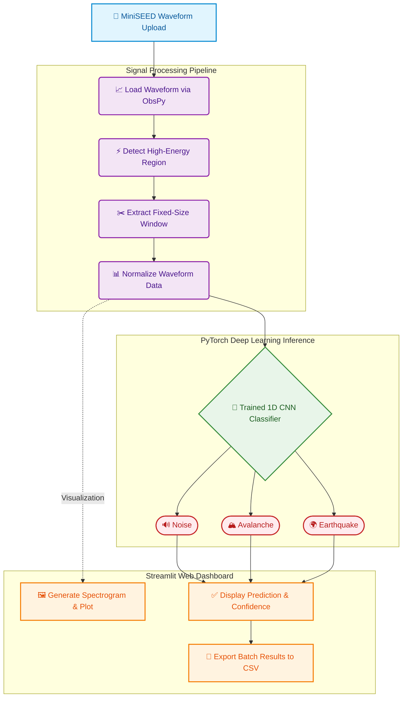

# AI-Powered Seismic Monitoring System

An end-to-end seismic event classification and monitoring platform built with **PyTorch**, **ObsPy**, and **Streamlit**.

The project classifies seismic waveform data into:

* **Noise**
* **Avalanche**
* **Earthquake**

It includes waveform visualization, spectrogram analysis, batch classification, example event exploration, and a deployed web dashboard.

---

## Live Demo

* **Streamlit App:** https://seismicmonitoringai-cosxplorer.streamlit.app/
* **GitHub Repository:** https://github.com/CosXplorer/Seismic_Monitoring_AI

---

## Project Overview

This project was developed as a Geophysics + Artificial Intelligence portfolio project focused on seismic event understanding and automatic classification.

It uses labeled MiniSEED seismic waveform data from the **Dischma Valley seismic network** (above Davos, Switzerland) and trains a deep learning model to classify events.

The final system supports:

* MiniSEED waveform loading
* Automatic high-energy event picking
* 1D CNN-based event classification
* Spectrogram visualization
* Batch file classification
* Example event browser
* Results table with CSV export
* Streamlit dashboard deployment

---

## System Architecture & Pipeline



---

## Dataset

The dataset consists of **926 labeled seismic events** recorded by a **5-station seismic array**.

### Stations

* CS
* CT
* NE
* SE
* WE

### Event Classes

| Class      | Count |
| ---------- | ----: |
| Noise      |   657 |
| Avalanche  |    84 |
| Earthquake |   185 |

### Dataset Notes

* Waveform files were provided in **MiniSEED (.mseed)** format.
* Waveform data were converted to **ground motion (m/s)**.
* Labels were provided through a metadata CSV file.

### Available Metadata Fields

* Event_id
* starttime
* initial_time
* end_time
* duration
* label
* av_score
* eq_score

---

## What I Built

### 1. Deep Learning Seismic Classifier

A custom **1D Convolutional Neural Network (CNN)** was trained to classify seismic waveform windows into:

* Noise
* Avalanche
* Earthquake

### 2. Automatic Event Window Extraction

The system automatically identifies high-energy regions within a seismic trace and extracts a fixed-size event window for classification.

### 3. Spectrogram Analysis

For every detected event window, a spectrogram is generated to visualize the time-frequency characteristics of the signal.

### 4. Streamlit Dashboard

The dashboard includes:

* Home Page
* File Classification Page
* Model Performance Page
* Example Events Page
* About Project Page

### 5. Batch Classification

Users can upload multiple MiniSEED files simultaneously and receive predictions for all files in a single session.

### 6. CSV Export

Batch classification results can be exported directly as a CSV file.

### 7. Example Event Browser

The dashboard contains built-in example seismic events for:

* Earthquake
* Avalanche
* Noise

allowing users to test the system instantly.

---

## Model Architecture

The classifier is implemented using **PyTorch**.

### Components

* 1D Convolution Layers
* Batch Normalization
* ReLU Activations
* Max Pooling
* Adaptive Average Pooling
* Fully Connected Classification Head

### Input

Fixed-length seismic waveform window.

### Output

Three-class probability distribution:

* Noise
* Avalanche
* Earthquake

---

## Final Model Performance

### Overall Metrics

| Metric          |  Value |
| --------------- | -----: |
| Test Accuracy   | 80.02% |
| Macro Precision |    80% |
| Macro Recall    |    61% |
| Macro F1 Score  |    67% |

### Class-wise Performance

| Class      | Precision | Recall | F1 Score | Support |
| ---------- | --------: | -----: | -------: | ------: |
| Noise      |      0.81 |   0.95 |     0.87 |     652 |
| Avalanche  |      0.88 |   0.44 |     0.59 |      84 |
| Earthquake |      0.72 |   0.45 |     0.55 |     185 |

---

## Confusion Matrix

| Actual \ Predicted | Noise | Avalanche | Earthquake |
| ------------------ | ----: | --------: | ---------: |
| Noise              |   617 |         3 |         32 |
| Avalanche          |    47 |        37 |          0 |
| Earthquake         |   100 |         2 |         83 |

---

## Dashboard Features

### Home

Provides an overview of the project, dataset, and supported functionality.

### Classify Files

Upload one or more MiniSEED files and obtain:

* Waveform Visualization
* Event Detection Marker
* Spectrogram Visualization
* Model Prediction
* Confidence Scores
* Batch Results Table
* CSV Export

### Model Performance

Displays:

* Test Accuracy
* Precision
* Recall
* F1 Score
* Class-wise Metrics
* Confusion Matrix
* Training Summary

### Example Events

Preloaded seismic examples:

* Earthquake
* Avalanche
* Noise

### About Project

Provides information about the technology stack and project goals.

---

## Technology Stack

### Programming & Machine Learning

* Python
* PyTorch

### Seismic Data Processing

* ObsPy

### Data Analysis

* NumPy
* Pandas

### Visualization

* Matplotlib
* SciPy

### Web Application

* Streamlit

---

## How It Works

### Processing Pipeline

1. Load MiniSEED waveform using ObsPy.
2. Detect high-energy event regions.
3. Extract fixed-size waveform window.
4. Normalize waveform values.
5. Perform CNN inference.
6. Generate class probabilities.
7. Visualize waveform and spectrogram.
8. Display prediction and confidence.
9. Export results if required.

---

## Repository Structure

```text
Seismic_Monitoring_AI/
├── app/
│   └── app.py
├── models/
│   └── best_seismic_model_v3.pth
├── examples/
│   ├── earthquake.mseed
│   ├── avalanche.mseed
│   └── noise.mseed
├── requirements.txt
├── README.md
└── .gitignore
```

---

## Local Installation

### Clone Repository

```bash
git clone https://github.com/CosXplorer/Seismic_Monitoring_AI.git
cd Seismic_Monitoring_AI
```

### Create Virtual Environment

```bash
python -m venv .venv
```

### Activate Environment

Windows:

```bash
.venv\Scripts\activate
```

### Install Dependencies

```bash
pip install -r requirements.txt
```

### Run Application

```bash
streamlit run app/app.py
```

---

## Use Cases

This project demonstrates practical applications in:

* Seismic Event Classification
* Earthquake Detection
* Avalanche Monitoring
* Geophysical Signal Processing
* Scientific Machine Learning
* Deep Learning on Time-Series Data
* Streamlit-based Scientific Dashboards

---

## Key Learning Outcomes

This project demonstrates:

* Real-world seismic waveform processing
* Deep learning on geophysical data
* Signal preprocessing and feature extraction
* Time-frequency analysis using spectrograms
* Model deployment using Streamlit
* Batch inference pipelines
* End-to-end ML project development

---

## Future Improvements

Potential future enhancements include:

* Real-time seismic stream monitoring
* Multi-station event localization
* Station-aware deep learning models
* Uncertainty estimation
* Explainable AI for seismic classification
* Advanced earthquake location estimation

---

## Author

**Ritesh Kumar (CosXplorer)**

Integrated M.Tech – Geophysical Technology
Indian Institute of Technology Roorkee

GitHub: https://github.com/CosXplorer

---

## Live Application

https://seismicmonitoringai-cosxplorer.streamlit.app/

## Source Code

https://github.com/CosXplorer/Seismic_Monitoring_AI
